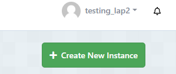

# Welcome to the Dairy

## How to use the diary

The diary is an application that allows the user to make posts to the diary.

### The main feastures of the diary: 

1. The diary allows the user to log in and view posts they have made. These will have a date and time attatched to them in the database. 

2. The user will be the only person who can view, add and remove posts from the diary. This is managed via an encrypted authentication process. 

## How to setup the diary:

1. in your terminal of choice, run the following:

```sh
git clone git@github.com:AlexWarden2/Diary_Hackathon.git && cd api
```

2. Install the relevent packages: 

```sh
npm install 
```
### How to configure the database

3. inside the api folder create a FILE called:
```sh
 .env 
```
Once this creates a file called \\\`.env`\\\ open it

4. Go to Elephant SQL: \\\ `https://api.elephantsql.com/` \\\
and make an account. You will then need to click 'Create new instance' in the top right. 
Name the Database and click through the green ok boxes until you reach a page with the details section. 


\\\ Coppy the URL that begins with 'postgres://...'

5. Inside the .env folder paste the following WITH the DB_URL being equal to the ElephantSQL one coppied. 
`DB_URL=postgres://...`
`PORT=3000`

5. Now still inside the api folder, run the following in the console:
```sh
npm run setup-db
npm run dev #this will start the application and make it live
```
6. To view the application from VS code, open the index.html file inside the client folder in 'live server'
The application will now work, you will need to create a user to log in. 
